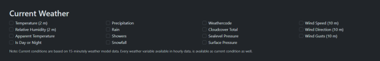
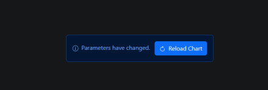
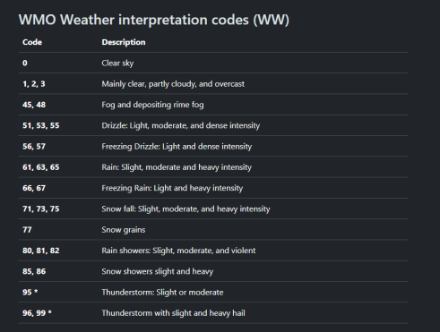
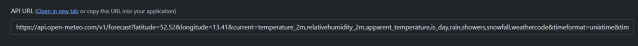

# Weather App Implementation

## Project Description
Implement an Android Weather App that provides real-time weather information for specific locations. The app should allow users to search for weather data by city name, display current weather conditions, including temperature and weather description, and provide a 5-day weather forecast. The app should also support offline access to cached data.

## Technologies and Tools
- Android Studio
- Kotlin
- Retrofit for network requests
- Open-Meteo API for weather data
- Coroutines for asynchronous operations
- Room for local data storage
- LiveData/Flow for real-time UI updates
- WorkManager for background task scheduling

## Project Duration
5-6 business days

## Project Milestones and Deadlines
- **Day 1-2: Project Setup and UI Design**
    - Set up the Android project in Android Studio.
    - Design the user interface (UI)
- **Day 2-3: Network Requests and API Integration**
    - Implement Retrofit for making network requests.
    - Create an interface for fetching weather data from the Open-Meteo API.
    - Integrate Coroutines for handling asynchronous network requests.
    - Use LiveData for real-time UI updates with both current weather and the 7-day weather forecast.
- **Day 4-5: Data Storage and Caching**
    - Implement Room for local data storage.
    - Cache both current weather and the 7-day weather forecast to support offline access.
- **Day 5-6: Background Tasks**
    - Use WorkManager to schedule background tasks

## Project Deliverables
- A functional Android Weather App for real-time weather data updates.
- Display of both current weather and a 7-day weather forecast.
- Offline access to cached weather information.
- Automatic background updates of weather data, and/or user notifications

## Tasks
### General
- Implement a user interface with the ability to navigate between current weather and the 7-day forecast.
- Fetch weather data from API and cache it (Use Retrofit for networking, Room for data persistence).
- Implement necessary casting of received data.
- Add background tasks such as user notifications.
- Use the current user location to display weather.

### Current Weather
- Write a user-friendly interface for current weather data as well as hourly weather for the current day. Should display at least 3 weather parameters (Temperature, high, low, rain, humidity, etc.).
- Display the fetched data from the API.

### Five-day Weather
- Write a user-friendly interface, with a list of weather forecasts for 7 days.
- Display the fetched data from the API.

**Optional:**
- Implement weather search by location.

## How to Use an API
Here is the official documentation of the free, non-commercial weather API: [Open-Meteo API Documentation](https://open-meteo.com/en/docs). It provides a list of available weather parameters for current, hourly, and daily weather.



To generate an API URL, pick the parameters needed in the app, and the link will appear below in the API URL field (Click on Reload Chart to regenerate the link).



To implement weather coding, use this list from the documentation.



**Important:**
Longitude and latitude of a location are required fields for this weather API call, as well as timezone (You can use `timezone=auto`). Also, recommend using `timeformat=unixtime` for future timestamp parsing.

To implement optional weather search by city, you can use the [Geocoding API](https://open-meteo.com/en/docs/geocoding-api) to get location coordinates.

### Example of API call:
Example of API URL:



### Example of JSON response:
```json
{
  "latitude": 52.52,
  "longitude": 13.419998,
  "generationtime_ms": 0.35500526428222656,
  "utc_offset_seconds": 7200,
  "timezone": "Europe/Berlin",
  "timezone_abbreviation": "CEST",
  "elevation": 38.0,
  "current_units": {
    "time": "unixtime",
    "interval": "seconds",
    "temperature_2m": "°C",
    "relativehumidity_2m": "%",
    "apparent_temperature": "°C",
    "is_day": "",
    "rain": "mm",
    "showers": "mm",
    "snowfall": "cm",
    "weathercode": "wmo code"
  },
  "current": {
    "time": 1698062400,
    "interval": 900,
    "temperature_2m": 14.4,
    "relativehumidity_2m": 72,
    "apparent_temperature": 13.3,
    "is_day": 1,
    "rain": 0.00,
    "showers": 0.00,
    "snowfall": 0.00,
    "weathercode": 2
  }
}
